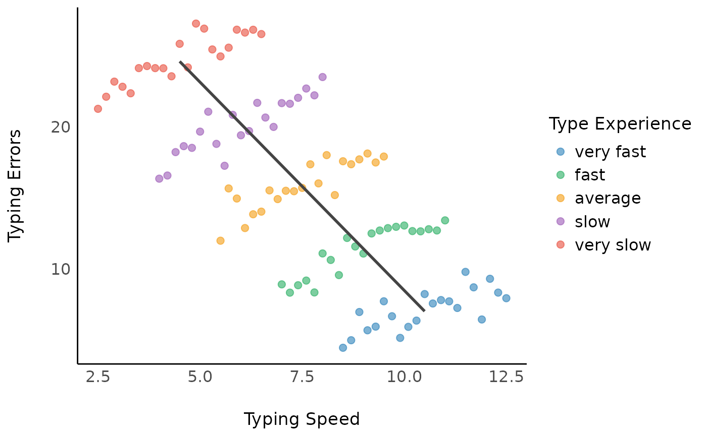
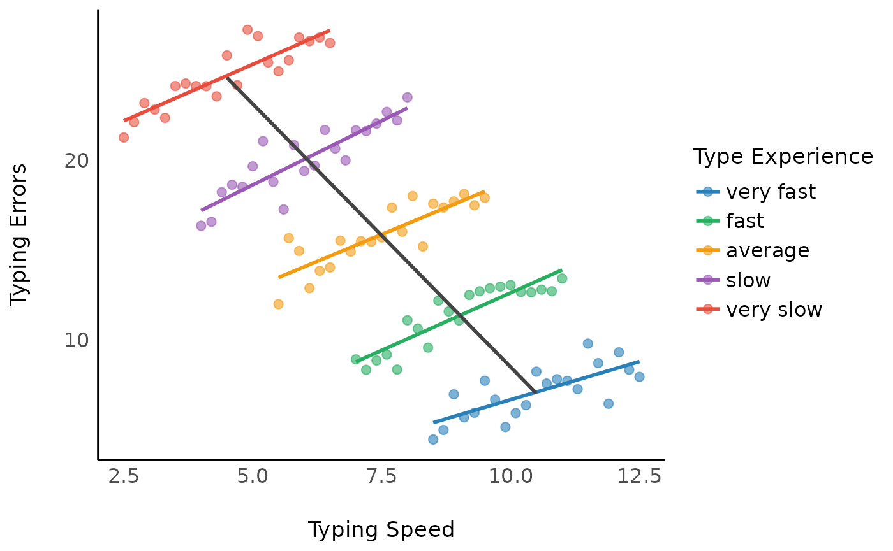

# GLM

---

## log link

 - 把predicotrs也log有助于解释，但是如果predictos含0则会有问题，此时可以通过 $\beta_1 log(x) + \beta_2 z_x$来辅助
	 - $z_x$项，当$x>0$时取0，$x=0$取1
	 - $log_x$项，在$x=0$时取0

```R
m3 <- lm(y ~ x_between, data = d)
m4 <- lmer(y ~ x_between + x_within + (1 | grp), data = d)
m5 <- lmer(y ~ x_between + x_within + (1 + x_within | grp), data = d)
model_parameters(m5)
```




## GLM Time-varying covariates

```R
# Model 4 - non-linear change in time, different slopes depending on covariate (interaction)
lmer(y ~ t*tpye + I(t^2)*tpye + tc + (1 + t | id), data)

lmer(y ~ s(t) + s(t, by = type) + tc + (1 + t | id), data)
```

## glm中的多层

 - `(1 | treatGroup/player)` : nesting between levels
   -  random effect: each player, who is nested inside of a treatment group with a random effect.
    -  fixed effect: incentive